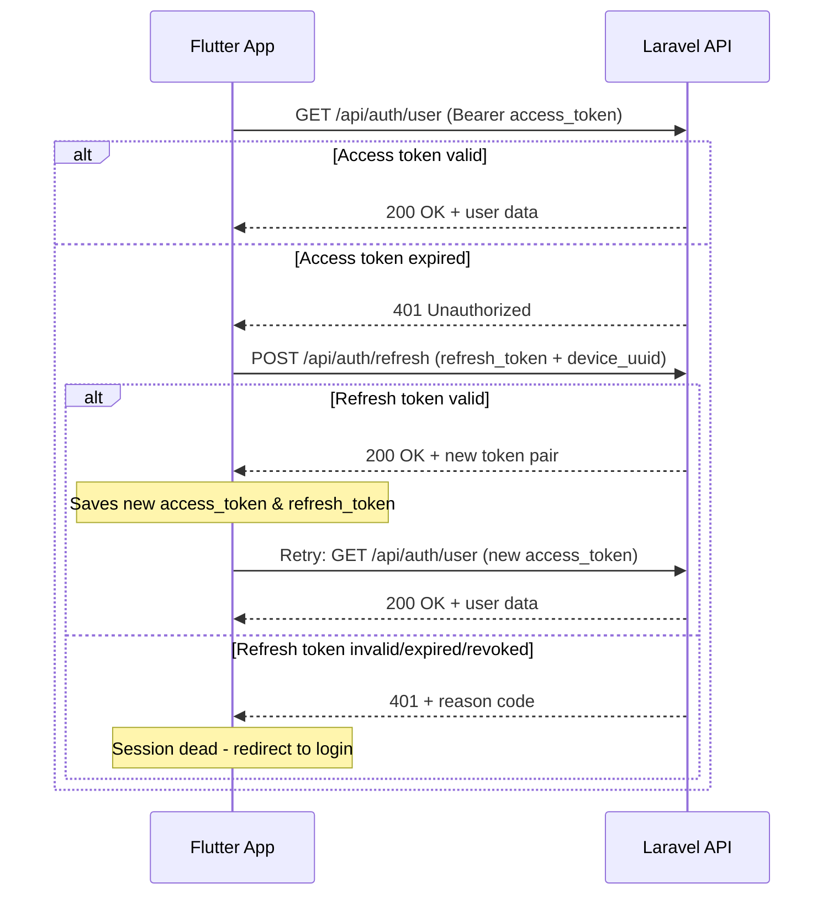
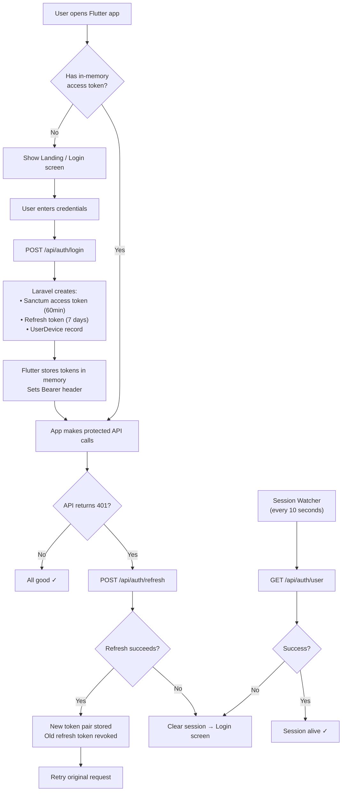

# Token & Refresh Token Authentication — How It Works

## Overview

The **Laravel 12** API issues a **token pair** (short-lived access token + long-lived refresh token) to the **Flutter** app. The Flutter app keeps them **in-memory only** and transparently refreshes when the access token expires.

---

## 1. The Token Pair (Laravel Side)

When a user logs in or registers from Flutter, Laravel's `AuthTokenService.php` creates **two tokens** inside a DB transaction:

| Token | How it's created | Lifetime | Storage |
|-------|-----------------|----------|---------|
| **Access token** | Laravel Sanctum `createToken()` — returns a plain-text bearer token | **60 minutes** (configurable in `config/auth_tokens.php`) | Hashed in `personal_access_tokens` table |
| **Refresh token** | Random 128-hex string via `bin2hex(random_bytes(64))` | **7 days** (configurable) | SHA-256 hash stored in `refresh_tokens` table |

Both tokens are returned in the JSON response along with `device_uuid` and expiry timestamps:

```json
{
  "success": true,
  "token_type": "Bearer",
  "access_token": "1|abc123...",
  "access_token_expires_at": "2026-02-17T20:00:00+00:00",
  "refresh_token": "e4f5a6b7c8d9...",
  "refresh_token_expires_at": "2026-02-24T19:00:00+00:00",
  "device_uuid": "a1b2c3d4-e5f6-...",
  "user": {
    "id": 1,
    "name": "John Doe",
    "email": "john@example.com",
    "role": "user",
    "has_pin_enabled": true
  }
}
```

### Configuration (`config/auth_tokens.php`)

```php
return [
    'access_ttl_minutes' => (int) env('ACCESS_TOKEN_TTL_MINUTES', 60),
    'refresh_ttl_days'   => (int) env('REFRESH_TOKEN_TTL_DAYS', 7),
];
```

---

## 2. How Flutter Uses the Tokens

### Login / Register → Store in Memory

When `auth_service.dart` calls `/api/auth/login` or `/api/auth/register`:

1. It sends credentials **+ device payload** (`device_uuid`, `platform`, `device_name`, `app_version`).
2. On success, it stores the response in **static in-memory variables**:

```dart
static String? _accessToken;                  // Bearer token for API calls
static String? _refreshToken;                 // Used only to get a new access token
static String? _deviceUuid;                   // Device identity
static Map<String, dynamic>? _currentUser;    // User profile
```

3. Sets the `Authorization: Bearer <access_token>` header on the Dio HTTP client.

> **Important:** Tokens are **never persisted to disk** — killing the app loses the session. Only `device_uuid` is saved to `SharedPreferences` so the same device identity is reused across sessions.

---

### Making Authenticated API Calls

Every protected call (e.g. `getUser()`, `unlock()`, `logout()`) goes through the `_authorizedCall()` wrapper method:

```dart
Future<Map<String, dynamic>> _authorizedCall(
  Future<Response<dynamic>> Function() request,
) async {
  try {
    final response = await request();
    return response.data as Map<String, dynamic>;
  } on DioException catch (e) {
    if (e.response?.statusCode == 401) {
      final refreshed = await refreshAccessToken();
      if (refreshed) {
        final retryResponse = await request();
        return retryResponse.data as Map<String, dynamic>;
      }
    }
    return await _handleError(e);
  }
}
```

**Flow:**

1. Make the API request with current `access_token`
2. If the server returns **401 Unauthorized** → attempt token refresh
3. If refresh succeeds → retry the original request with the new `access_token`
4. If refresh fails → the request fails; session is dead

---

### Sequence Diagram: Authenticated API Call with Refresh



---

## 3. The Refresh Flow in Detail

When a 401 is received, `refreshAccessToken()` does the following:

1. Sends `POST /api/auth/refresh` with `{ refresh_token, device_uuid }`
2. Laravel's `rotateRefreshToken()` method:
   - Finds the refresh token by its SHA-256 hash
   - Checks it's not revoked, not expired, and the device UUID matches
   - **Revokes the old refresh token** (sets `revoked_at`)
   - Issues a **brand new token pair** (new access token + new refresh token)
   - Links the new refresh token to the old one via `rotated_from_id`
3. Flutter replaces both tokens in memory and retries the original request **once**

> **Note:** This is called **refresh token rotation** — every refresh gives you a *new* refresh token. The old one is permanently revoked. This prevents replay attacks.

### Laravel `rotateRefreshToken()` Summary

```php
// 1. Find the refresh token by hash
$refreshToken = RefreshToken::with(['user', 'device'])
    ->where('token_hash', $tokenHash)
    ->whereNull('revoked_at')
    ->where('expires_at', '>', now())
    ->lockForUpdate()
    ->first();

// 2. Revoke the old token
$refreshToken->update([
    'revoked_at'   => now(),
    'last_used_at' => now(),
]);

// 3. Issue an entirely new token pair
$issued = $this->issueTokenPair($user, $request, $payload, false);

// 4. Link rotation chain
RefreshToken::where('token_hash', hash('sha256', $issued['refresh_token']))
    ->update(['rotated_from_id' => $refreshToken->id]);
```

---

## 4. Session Watcher (Forced Logout Detection)

In `main.dart`, a `Timer.periodic` runs **every 10 seconds** (and on app resume):

1. Calls `getUser()` to validate the session
2. If it fails (and refresh also fails), it reads the `_lastSessionEndReason` stored during the failed refresh
3. Clears the session and navigates to `/landing` with a user-facing snackbar message

### Reason Codes and User Messages

| Reason Code | User Message | When It Happens |
|---|---|---|
| `SESSION_REVOKED` | "You have been logged out because your account was used on another device." | Admin revoked session or user logged in on another device |
| `REFRESH_TOKEN_EXPIRED` | "Your session expired. Please log in again." | 7 days passed without refresh |
| `DEVICE_MISMATCH` | "This session is not valid for this device. Please log in again." | Refresh token belongs to a different device |
| `NO_REFRESH_TOKEN` | "Your session ended. Please log in again." | No refresh token was stored in memory |
| `SESSION_INVALIDATED` | "Your session ended. Please log in again." | Generic fallback for any other failure |

### Session Watcher Code

```dart
void _startSessionWatcher() {
  _sessionTimer?.cancel();
  _sessionTimer = Timer.periodic(const Duration(seconds: 10), (_) {
    _checkSessionAndHandleExpiry();
  });
}

Future<void> _checkSessionAndHandleExpiry() async {
  final authService = ref.read(authServiceProvider);
  if (!authService.isAuthenticated()) return;

  final result = await authService.getUser();
  if (result['success'] == true) return;  // Session is alive

  // Session is dead
  final reason = authService.consumeSessionEndReason();
  authService.clearSession();
  // Navigate to /landing and show snackbar with reason message
}
```

---

## 5. Device Management

Each Flutter device is registered in the `user_devices` table. Key behaviors:

| Action | What Happens |
|--------|-------------|
| **Login/Register** | `UserDevice::updateOrCreate()` — creates or updates the device record |
| **Access token naming** | Named `mobile-app:<device_uuid>` so Laravel can identify which device is calling |
| **Revoke per device** | `revokeDeviceSession()` — deletes the Sanctum token, revokes the refresh token, and removes the device record |
| **Revoke all** | `revokeAll()` — deletes all Sanctum tokens, revokes all refresh tokens, removes all device records |
| **Activity tracking** | `TrackApiSessionActivity` middleware updates `last_connected_time` on each authenticated request |

---

## 6. API Endpoints Reference

### Public Endpoints (No Token Required)

| Method | Endpoint | Purpose |
|--------|----------|---------|
| POST | `/api/auth/validate-email` | Check if email exists, get user preview |
| POST | `/api/auth/login` | Login with email + password or PIN |
| POST | `/api/auth/register` | Register new user with business code |
| POST | `/api/auth/forgot-password` | Send password reset email |
| POST | `/api/auth/validate-business-code` | Validate business/super-admin code |
| POST | `/api/auth/refresh` | Exchange refresh token for new token pair |

### Protected Endpoints (Bearer Token Required)

| Method | Endpoint | Purpose |
|--------|----------|---------|
| POST | `/api/auth/logout` | Logout and revoke all tokens |
| POST | `/api/auth/unlock` | Verify credentials for lock screen |
| GET | `/api/auth/user` | Get authenticated user profile |

---

## 7. Complete Lifecycle Flowchart



---

## 8. Security Considerations

### Current Strengths

- **Token rotation** — refresh tokens are single-use; prevents replay attacks
- **Device binding** — refresh tokens are tied to specific devices
- **Memory-only** — tokens aren't persisted, so physical device access doesn't expose tokens
- **Single session** — logging in from Flutter revokes all existing web sessions
- **Forced logout** — session watcher detects revocation within 10 seconds

### Potential Improvements

1. **Proactive refresh** — Instead of waiting for a 401, check `access_token_expires_at` and refresh ~5 minutes before expiry. Currently, `access_token_expires_at` is returned by the API but **not stored** in Flutter.

2. **Secure storage** — If persistent sessions are desired, store the refresh token in `flutter_secure_storage` (iOS Keychain / Android Keystore).

3. **Centralized auth state** — The `isAuthenticatedProvider` uses `ref.read()` which doesn't trigger reactivity. A `StateNotifier` or `AsyncNotifier` that rebuilds the widget tree on auth state changes would be more robust.

---

## 9. Key Files Reference

### Laravel Application

| File | Purpose |
|------|---------|
| `routes/api.php` | API route definitions |
| `app/Http/Controllers/Api/ApiAuthController.php` | Auth endpoint logic |
| `app/Services/AuthTokenService.php` | Token issuance, rotation, revocation |
| `app/Models/RefreshToken.php` | Refresh token Eloquent model |
| `app/Http/Middleware/TrackApiSessionActivity.php` | API session activity tracking |
| `config/auth_tokens.php` | Token TTL configuration |

### Flutter Application

| File | Purpose |
|------|---------|
| `lib/data/services/auth_service.dart` | HTTP client, token storage, refresh logic |
| `lib/providers/auth_provider.dart` | Riverpod providers for auth state |
| `lib/main.dart` | Session watcher and forced logout handling |
