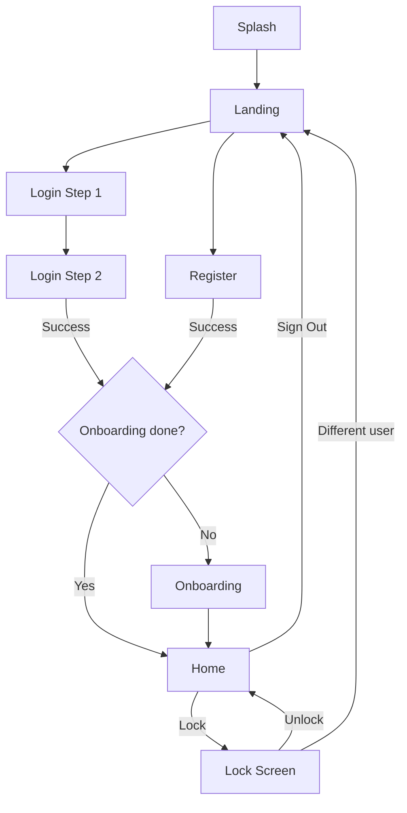

# Session Management: No-Persist Login, Lock Screen, Logout, Onboarding Reorder

Three changes requested:
1. **No persistent sessions** — closing the app requires re-login
2. **Lock screen + Sign out** — matching Laravel's lock screen (PIN/password, user preview) and logout flow
3. **Onboarding after login** — show onboarding walkthrough after first successful login, not before

## Proposed Changes

### 1. Session-Only Auth (No Persistence)

#### [MODIFY] [auth_service.dart](file:///Users/pinakranjansahoo/Documents/Common_Projects/flutter/Dalmia/sequence/lib/data/services/auth_service.dart)

- Keep token **in-memory only** (remove `SharedPreferences` storage for token)
- Keep user data in-memory only for the current session
- **Keep** remembered email in `SharedPreferences` (persists across restarts for convenience)
- `isAuthenticated()` checks in-memory token instead of storage
- `clearSession()` resets the in-memory fields

---

### 2. Lock Screen

#### [NEW] [lock_screen.dart](file:///Users/pinakranjansahoo/Documents/Common_Projects/flutter/Dalmia/sequence/lib/presentation/screens/auth/lock_screen.dart)

Mirrors Laravel's `lock.blade.php`:
- Shows **user avatar, name, role badge, email** (same layout as `LoginCredentialsScreen`)
- PIN/Password toggle (PIN shown only if user has PIN enabled)
- PIN: 4 individual digit inputs with auto-focus, auto-submit
- Password: input with show/hide toggle
- **"Unlock" button** → validates credentials via API `/login` endpoint
- **"Sign in as different user"** link → calls logout API + navigates to `/landing`
- On success → navigates to `/home`

#### [NEW] Laravel API endpoint for unlock

> [!NOTE]
> We can reuse the existing `/api/auth/login` endpoint for unlock verification since it accepts email + PIN/password. No new Laravel endpoint needed.

---

### 3. Sign Out

#### [MODIFY] [home_screen.dart](file:///Users/pinakranjansahoo/Documents/Common_Projects/flutter/Dalmia/sequence/lib/presentation/screens/home/home_screen.dart)

- Add a **popup menu** to the AppBar with two options:
  - **Lock** → navigates to `/lock` (keeps session alive)
  - **Sign Out** → calls `AuthService.logout()`, clears in-memory token, navigates to `/landing`

---

### 4. Onboarding After Login

#### [MODIFY] [splash_screen.dart](file:///Users/pinakranjansahoo/Documents/Common_Projects/flutter/Dalmia/sequence/lib/presentation/screens/splash/splash_screen.dart)

- Remove onboarding check from splash
- Always navigate to `/landing` (since token is never persisted)

#### [MODIFY] [login_credentials_screen.dart](file:///Users/pinakranjansahoo/Documents/Common_Projects/flutter/Dalmia/sequence/lib/presentation/screens/auth/login_credentials_screen.dart)

- After successful login → check `onboarding_completed_{version}`
- If not completed → navigate to `/onboarding`
- If completed → navigate to `/home`

#### [MODIFY] [register_screen.dart](file:///Users/pinakranjansahoo/Documents/Common_Projects/flutter/Dalmia/sequence/lib/presentation/screens/auth/register_screen.dart)

- Same post-login check: onboarding → home

#### [MODIFY] [onboarding_screen.dart](file:///Users/pinakranjansahoo/Documents/Common_Projects/flutter/Dalmia/sequence/lib/presentation/screens/onboarding/onboarding_screen.dart)

- After onboarding done → navigate to `/home` (user is already authenticated at this point)

#### [MODIFY] [main.dart](file:///Users/pinakranjansahoo/Documents/Common_Projects/flutter/Dalmia/sequence/lib/main.dart)

- Add `/lock` route pointing to `LockScreen`

---

## Navigation Flow

## Verification Plan

- Full restart → lands on Landing page (no persistent token)
- Login → if first time, shows Onboarding → then Home
- Login → if returning user, goes directly to Home
- From Home → Lock → shows lock screen with user preview → unlock returns to Home
- From Home → Sign Out → lands on Landing page
- Close app → reopen → lands on Landing page (session cleared)
